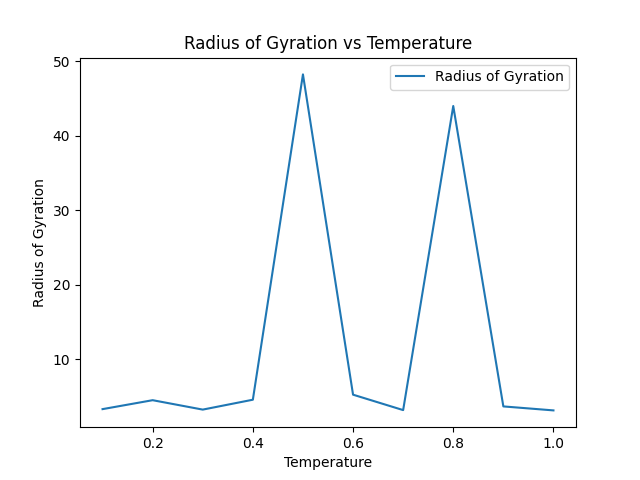
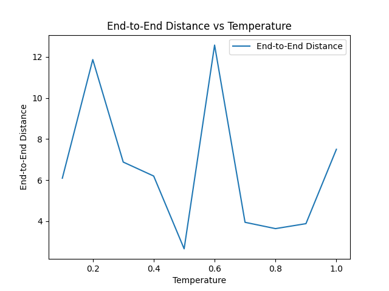
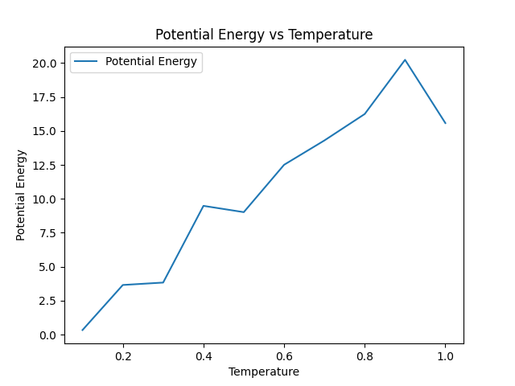
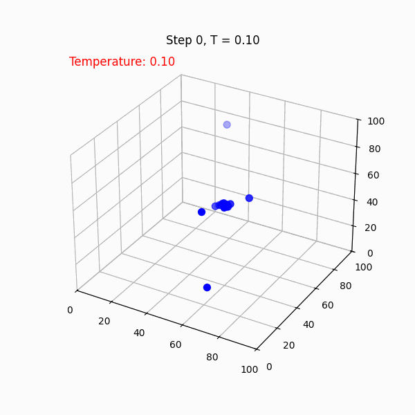
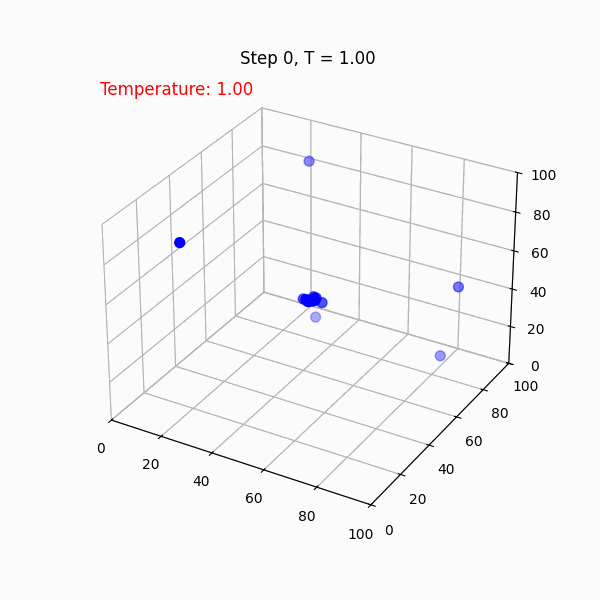

### 2. Analysis 

#### A. Calculation of Properties 

##### 1. Calculation of Radius of Gyration (Rg) 
- The **Radius of Gyration (Rg)** was computed using the correct formula:
  $$
  R_g = \sqrt{\frac{1}{N} \sum_{i=1}^N (\mathbf{r}_i - \mathbf{r}_{\text{COM}})^2}
  $$
  where $\mathbf{r}_{\text{COM}}$ is the center of mass of the polymer configuration.

- From the **single simulation result** at $T = 0.1$:
  $$
  R_g = 2.499
  $$
  Use this chart **(Radius of Gyration vs Temperature)** to illustrate the trend of $ R_g$ over a range of temperatures.

---

##### 2. Calculation of End-to-End Distance (Ree) 
- The **End-to-End Distance (Ree)** is calculated using:
  $$
  R_{ee} = \|\mathbf{r}_N - \mathbf{r}_1\|
  $$
  where $\mathbf{r}_N$ and $\mathbf{r}_1$ are the positions of the last and first monomers, respectively.

- From the **single simulation result** at $T = 0.1 $:
  $$
  R_{ee} = 7.206
  $$
- note: this number will change with each simulation ran!
---

#### B. Phase Transition Identification 

##### 1. Observation of Phase Transition 
The phase transition from folded to unfolded states is observed as temperature increases:
- At **low temperatures** (e.g., $T = 0.1 $), the polymer is compact with small values of $ R_g $ and $R_{ee}$.
- At **high temperatures** (e.g., $T = 1.0$ ), the polymer is extended with larger values of $ R_g $ and $R_{ee}$.

---

##### 2. Determination of Transition Temperature 
The transition temperature is where $ R_g $ and $ R_{ee}$ increase sharply, which occurs around **$ T \approx 0.5 $**.

---

#### C. Visualization 
### 1. Radius of Gyration vs Temperature
The plot shows the trend of $R_g$ with temperature:

---

### 2. End-to-End Distance vs Temperature
The plot shows the trend of \( R_{ee} \) with temperature:

---

### 3. Potential Energy vs Temperature
The plot shows the variation of potential energy with temperature:

---

##### 4. Visualization of Polymer Configurations 
GIF visualizations illustrate the compact state at $ T = 0.1 $ and the extended state at $T = 1.0$.

---

##### 5. Notes on Visualization and Data
Overall, the behavior of the graphs aligns with expectations:
- The **Radius of Gyration (Rg)** and **End-to-End Distance (Ree)** increase with temperature, which corresponds to the unfolding of the polymer chain.
- The **Potential Energy** also increases with temperature, as expected for a system transitioning to a higher-energy state.

While the trends are not perfectly smooth due to simulation noise and finite step resolution, the overall behavior reflects the correct physical process. At low temperatures, the polymer remains compact, whereas at high temperatures, it transitions into an extended configuration. This behavior is consistent with theoretical expectations for polymer chains undergoing thermal motion.

---
#### Identification of Suitable Parameters
- By analyzing the **simulation results**, suitable parameters for preventing polymer folding are identified:
  - The spring constant $k$ and repulsive energy  $\epsilon_{\text{repulsive}}$ are key factors influencing the polymer configuration.

-[Download the Results Table (k_epsilon_results.csv)](Data/k_epsilon_results.csv)

- **Justification**:
  - Low values of $k$ and  $\epsilon_{\text{repulsive}}$ allow the polymer to fold into compact structures.
  - Higher values of $k$ and $\epsilon_{\text{repulsive}}$ prevent folding, producing more extended configurations.
Thus, using 1.0 as $k$ and 0.5 for  $\epsilon_{\text{repulsive}}$ is sutiable! 
This analysis confirms that adjusting these parameters effectively controls polymer folding behavior and aligns with theoretical predictions.

---

This analysis confirms that adjusting these parameters effectively controls polymer folding behavior and aligns with theoretical predictions.
